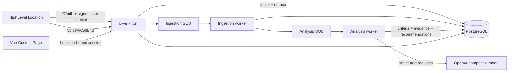

# Voice AI Observability Copilot

A HighLevel Marketplace app that turns completed Voice AI calls into an evidence-backed
Success Criteria checklist and actionable, agent-level recommendations.

Repository: [github.com/jatinjdev/highlevel-voice-ai-observability-copilot](https://github.com/jatinjdev/highlevel-voice-ai-observability-copilot)

## What it does

1. A Marketplace installation authorizes one HighLevel Location.
2. Opening **Voice Agents** discovers the Location's existing agents.
3. New `VoiceAiCallEnd` webhooks and user-requested 24-hour or 7-day imports enter the same
   durable ingestion pipeline.
4. Each transcript is evaluated only against that agent's Success Criteria.
5. Failed criteria retain their reason and exact transcript or Call Action evidence.
6. The embedded Vue dashboard rolls failures up from call to agent to Location.
7. On request, recommendations compare recent failures with the agent's current HighLevel
   configuration and propose one supported change.

The product deliberately avoids an opaque overall score, automatic agent mutation, and
call-level recommendations. A recommendation may contain an exact prompt removal, a paste-ready
addition, both, or direct advice for a supported HighLevel setting such as Actions, Knowledge Base,
greeting, or transcription configuration.

## Architecture



PostgreSQL is the system of record. Queue messages carry internal identifiers rather than
transcripts or credentials. The API, ingestion worker, and analysis worker are separate NestJS
processes with runtime-validated contracts. The current deployment runs them as three containers
on one EC2 host, which keeps the deployment inexpensive and explainable while preserving independent
process boundaries.

```text
apps/
  api/               OAuth, sessions, webhooks, outbox, dashboard API, demo fixture
  ingestion-worker/  Idempotent call and transcript normalization
  analysis-worker/   Criteria evaluation, call overview, agent recommendations
  web/               Vue 3 embedded HighLevel Custom Page
packages/
  contracts/         Shared Zod HTTP and event contracts
  database/          Drizzle schema
  messaging/         SQS publisher and consumer primitives
infra/
  aws/               CloudFormation and release scripts
  localstack/        Local SQS initialization
```

### Analysis boundaries

- **Call evaluation:** one structured model request checks every criterion as `pass`, `fail`,
  `not_applicable`, or `unknown`. The agent prompt is excluded because a current prompt cannot be
  proven to have handled a historical call. A failure without valid stored evidence becomes
  `unknown`.
- **Call overview:** a separate structured request produces intent, outcome, and sentiment after the
  checklist result exists. The displayed summary comes from the stored HighLevel call record.
- **Agent recommendation:** user-requested jobs aggregate up to 20 recent failures for one criterion,
  then compare them with one freshly fetched configuration snapshot. Output is constrained to a
  compact allowlist of real HighLevel Voice AI configuration surfaces. Recommendations never write
  back to HighLevel.

## Local setup

Prerequisites: Node.js 22.20+, pnpm 10+, and Docker Desktop.

```bash
cp .env.example .env
pnpm install --frozen-lockfile
docker compose up -d
pnpm db:migrate
pnpm dev
```

- Dashboard: <http://localhost:5173>
- API: <http://localhost:3000/api>
- Swagger: <http://localhost:3000/api/docs>

LocalStack provides the two queues and DLQs. Set `OUTBOX_PUBLISHER_ENABLED=true` to exercise the
asynchronous path locally. With `LLM_PROVIDER=none`, infrastructure can run without manufacturing
semantic results; analysis completes with `unknown`. For real evaluation, set
`LLM_PROVIDER=openai-compatible`, `LLM_BASE_URL`, `LLM_MODEL`, and `LLM_API_KEY`. JSON Schema is the
preferred structured-output mode, with JSON Object mode available for compatible providers that do
not implement JSON Schema.

## HighLevel sandbox installation

The Marketplace app is private, targets **Sub-account**, and is installed into an App Test Account
Location. It uses OAuth, a Custom Page, signed iframe user context, and the `VoiceAiCallEnd` webhook.
No Private Integration Token or workflow is part of the deployed path.

The required scopes, Marketplace builder values, URLs, installation steps, and verification checks
are documented in [docs/HIGHLEVEL_INTEGRATION_RUNBOOK.md](./docs/HIGHLEVEL_INTEGRATION_RUNBOOK.md).

## Existing calls and demo data

Opening the dashboard discovers agents but does not import call history. From an agent page,
**Analyze → Last 24 hours** or **Last 7 days** imports that external agent's paginated Call Logs.
Imports are additive and deduplicated by `(Location, HighLevel Call ID)`.

The config-driven demo fixture is an intentionally incomplete bakery agent with controlled
transcripts. Because it has no external HighLevel identity, its setup command directly inserts
controlled agent, configuration, criteria, call, transcript, and action records. From analysis
scheduling onward, it uses the same SQS jobs, workers, criteria evaluator, recommendation generator,
result tables, and UI read models as real calls.

```bash
pnpm --filter @copilot/api demo:agent -- seed --location <location-id>
pnpm --filter @copilot/api demo:agent -- analyze --location <location-id>
pnpm --filter @copilot/api demo:agent -- recommend --location <location-id>
pnpm --filter @copilot/api demo:agent -- verify --location <location-id>
```

## Functional vs. test-only

**Functional end to end:** Marketplace OAuth and lifecycle storage, encrypted token refresh,
Location-bound Custom Page sessions, Ed25519 webhook verification, paginated agent and Call Log
fetching, PostgreSQL inbox/outbox, SQS/DLQs, idempotent ingestion, structured LLM evaluation,
evidence navigation, agent-level recommendations, and the embedded Vue dashboard.

**Test-only or intentionally limited:** the demo agent and calls are fixture data and bypass
HighLevel ingestion and transcript normalization; LocalStack replaces AWS SQS locally;
recommendations are advisory and never mutate HighLevel; automated periodic missed-webhook
reconciliation is not included in the current release.

## Product capabilities

| Requirement                  | Product proof                                                                                                       |
| ---------------------------- | ------------------------------------------------------------------------------------------------------------------- |
| Ingest existing transcripts  | Agent-scoped 24-hour and 7-day Call Log imports                                                                     |
| Monitor new calls            | Signed `VoiceAiCallEnd` webhook and durable background processing                                                   |
| Agent-specific observability | Universal checks plus business-owned criteria entered in natural language from the agent's goals, script, or policy |
| Identify failures            | Categorical checklist results with validated evidence                                                               |
| Unified dashboard            | Fleet, agent, and forensic call views inside HighLevel                                                              |
| Immediate recommendations    | On-demand prompt patches or supported configuration advice                                                          |
| Highlight review segments    | `View evidence` scrolls to the cited transcript line                                                                |

## Quality and deployment

```bash
pnpm format:check
pnpm check
docker compose --file compose.production.yaml config --quiet
docker build --tag voice-ai-observability:local .
```

`pnpm check` runs lint, typecheck, tests, and production builds across the monorepo. CI repeats those
checks, validates the production Compose file, builds the container, verifies its non-root user, and
replays all migrations against clean PostgreSQL.

The AWS deployment uses CloudFront/S3, an ALB, one SSM-managed EC2 host, private RDS
PostgreSQL, SQS/DLQs, ECR, Secrets Manager, and CloudWatch. Deployment commands are in
[infra/aws/README.md](./infra/aws/README.md).
