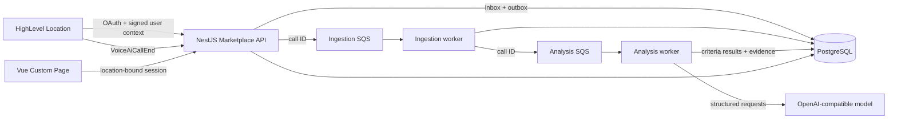

# Voice AI Observability Copilot

A HighLevel Marketplace app that turns completed Voice AI calls into an evidence-backed
Success Criteria checklist and optional, paste-ready prompt guidance.

Repository: [github.com/jatinjdev/highlevel-voice-ai-observability-copilot](https://github.com/jatinjdev/highlevel-voice-ai-observability-copilot)

## Product loop

1. A Marketplace installation authorizes one HighLevel Location.
2. Historical sync and `VoiceAiCallEnd` webhooks enter the same durable ingestion path.
3. Each call transcript is evaluated only against that Voice Agent's Success Criteria.
4. Every failed criterion cites exact transcript or executed Call Action evidence.
5. The embedded dashboard rolls failures up by Voice Agent and criterion.
6. On request, the user can generate one recommendation for a failed criterion. The model
   compares recent failures with the agent's current prompt and returns a copy-paste prompt
   addition only when the prompt does not already address the concern.

There is no opaque quality score, automatic agent mutation, or call-level recommendation.
The UI follows the same concepts as the implementation: Voice Agent, Success Criterion,
Call Analysis, Call Evidence, and Prompt Recommendation.

## Architecture



The API, ingestion worker, and analysis worker are separate NestJS processes. PostgreSQL is
the system of record; SQS messages contain identifiers rather than transcripts or credentials.
The assignment deployment runs the three processes as separate containers on one EC2 host to
keep the infrastructure explainable and inexpensive. The process boundaries can scale
independently later without changing the product model.

```text
apps/
  api/               OAuth, webhooks, sessions, outbox, dashboard API
  ingestion-worker/  Idempotent call normalization
  analysis-worker/   Checklist evaluation and requested prompt guidance
  web/               Vue 3 HighLevel Custom Page
packages/
  contracts/         Zod-validated HTTP and event contracts
  database/          Shared Drizzle schema
  messaging/         SQS publisher and consumer primitives
infra/
  aws/               CloudFormation and deliberately small release scripts
  localstack/        Local queues and DLQs
```

The domain model and non-obvious invariants are documented in [CONTEXT.md](./CONTEXT.md).
Short architectural decisions live in [docs/architecture](./docs/architecture/README.md).

## Local setup

Prerequisites: Node.js 22.20+, pnpm 10+, Docker Desktop, and an optional
OpenAI-compatible model credential.

```bash
cp .env.example .env
pnpm install --frozen-lockfile
docker compose up -d
pnpm db:migrate
pnpm dev
```

The dashboard runs at <http://localhost:5173>, the API at <http://localhost:3000/api>,
and Swagger at <http://localhost:3000/api/docs>.

LocalStack creates the ingestion and analysis queues plus DLQs. Set
`OUTBOX_PUBLISHER_ENABLED=true` to exercise the asynchronous path. With
`LLM_PROVIDER=none`, calls complete with `unknown` results so infrastructure can be tested
without inventing semantic judgments. For real evaluation, configure
`LLM_PROVIDER=openai-compatible`, `LLM_BASE_URL`, `LLM_MODEL`, and `LLM_API_KEY` when the
provider requires one. The model adapter is provider-agnostic and uses structured output.

The local-only `opencode` adapter can use an interactive developer subscription for a demo.
Production rejects that adapter and requires an unattended service credential.

To import existing calls for an OAuth-installed Location:

```bash
pnpm build
pnpm --filter @copilot/api sync:location -- <highlevel-location-id>
```

For a reproducible product test, seed the intentionally incomplete prompt-remediation fixture.
It enters through the same inbox, queues, workers, evaluator, and read models as a real call:

```bash
pnpm --filter @copilot/api seed:prompt-remediation
```

## HighLevel sandbox installation

The Marketplace app targets **Sub-account** users and is installed into a sandbox Location.
It uses a Custom Page, OAuth, signed iframe user context, and the `VoiceAiCallEnd` webhook.
No Private Integration Token or workflow is part of the production path.

The exact Marketplace builder settings, scopes, URLs, install steps, and verification
checklist are in [docs/HIGHLEVEL_INTEGRATION_RUNBOOK.md](./docs/HIGHLEVEL_INTEGRATION_RUNBOOK.md).

## Quality gate

```bash
pnpm format:check
pnpm check
docker compose --file compose.production.yaml config --quiet
docker build --tag voice-ai-observability:local .
```

`pnpm check` runs lint, typecheck, tests, and production builds across every workspace.
CI repeats those checks, builds the production image, confirms the container runs as a
non-root user, and replays all migrations against a clean PostgreSQL service.

## Assignment coverage

| Brief requirement              | Implemented product proof                                                                                                             |
| ------------------------------ | ------------------------------------------------------------------------------------------------------------------------------------- |
| Ingest existing transcripts    | Idempotent historical sync feeds the canonical inbox/outbox and SQS path                                                              |
| Monitor future calls           | Signed `VoiceAiCallEnd` webhook persists before returning and queues background work                                                  |
| Agent-specific observability   | Each Voice Agent owns editable Success Criteria; name is the stable aggregation key and description is the full evaluator instruction |
| Deviations and missed outcomes | Categorical pass/fail/not-applicable/unknown results with validated Call Evidence                                                     |
| Unified dashboard              | Fleet, agent, and call views embedded as a HighLevel Custom Page                                                                      |
| Immediate actionable guidance  | On-demand, criterion-specific prompt guidance generated from recent failures and the current prompt                                   |
| Specific segments for review   | `View evidence` selects and scrolls to the cited transcript line                                                                      |

See [docs/ASSESSMENT_TRACEABILITY.md](./docs/ASSESSMENT_TRACEABILITY.md) for the complete
requirements-to-code map and [docs/DEMO_SCRIPT.md](./docs/DEMO_SCRIPT.md) for a four-minute demo.

## Functional vs. test-only

**Functional end to end:** Marketplace OAuth and lifecycle storage, token encryption and
refresh, signed Custom Page sessions, Ed25519 webhook verification, PostgreSQL inbox/outbox,
SQS/DLQs, historical sync, idempotent ingestion, structured LLM evaluation, evidence
validation, agent-level prompt guidance, reanalysis, embedded Vue UI, RDS, CloudFront/S3,
ALB/EC2, ECR, Secrets Manager, CloudWatch, and deployment scripts.

**Test-only or intentionally limited:** the prompt-remediation scenario pack contains mock
calls; LocalStack replaces AWS SQS locally; OpenCode is a local demo adapter; historical sync
is manually triggered rather than scheduled; reconciliation and large-list cursor pagination
are documented production increments. No UI button changes a HighLevel agent automatically.

## Team of One ownership

- **Product:** reduced observability to a user-explainable loop instead of an arbitrary score.
- **Design:** kept the fleet, agent checklist, call evidence, and prompt guidance at distinct
  levels so a business owner always knows what happened and what to do next.
- **Engineering:** separated installation, ingestion, evaluation, and presentation behind
  runtime-validated contracts and durable delivery boundaries.
- **QA:** tests enforce tenant/session security, webhook signatures, provider contracts,
  evaluator isolation, evidence mapping, recommendation shape, UI states, and fixture coverage;
  the final release gate also replays migrations and exercises the real UI flow.

## Deployment and security

The AWS assignment stack uses CloudFront/S3, a CloudFront-restricted ALB, one SSM-managed EC2
host, private encrypted RDS PostgreSQL, SQS/DLQs, ECR, Secrets Manager, and CloudWatch. Use
[infra/aws/README.md](./infra/aws/README.md) for change-scoped deployment commands.

OAuth tokens are encrypted with AES-256-GCM, webhook signatures are checked over the exact
request bytes, browser sessions are bound to signed HighLevel context, queues carry no
transcripts, common contact data is redacted before model calls, containers run as a non-root
user with read-only filesystems, and browser bundles never receive service secrets.

Current limitations and the evidence-based production backlog are explicit in
[docs/IMPLEMENTATION_STATUS.md](./docs/IMPLEMENTATION_STATUS.md).
