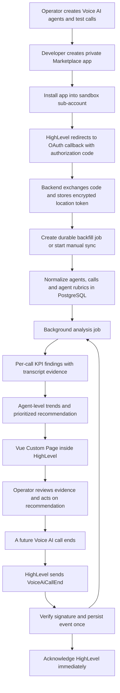

# HighLevel Integration and Production Flow

This document is the source of truth for how the Voice AI Observability Copilot integrates with HighLevel and which steps must be configured manually in HighLevel.

> Implementation status: Marketplace OAuth, encrypted token persistence and rotation,
> install/update/uninstall lifecycle handling, signed Custom Page sessions, durable
> `VoiceAiCallEnd` ingestion, SQS workers, transcript analysis, and the unified
> dashboard and the assignment AWS stack are implemented. Automatic paginated
> backfill/reconciliation, evaluation calibration, and horizontally scalable
> process scheduling remain. See
> [Implementation status](./IMPLEMENTATION_STATUS.md).

## Product boundary

The Copilot is a post-call observability system. It does not join or alter an active call.

It:

1. Reads Voice AI agent configuration and historical call logs.
2. Receives a `VoiceAiCallEnd` event after future calls finish.
3. Evaluates each transcript against the selected agent's success criteria.
4. Shows evidence and recommended prompt/script changes in a Vue Custom Page embedded inside HighLevel.

The current slice produces per-call recommendations. Recurring failure clustering
across an agent's history is the next analysis increment and is not represented as
complete in the UI.

HighLevel hosts the navigation entry and iframe. Our infrastructure hosts the Vue application, NestJS API, database, analysis worker, and model calls.

## System flow

## Values required before configuring HighLevel

Deploy the app before creating the Marketplace version. Replace `https://copilot.example.com` below with the stable HTTPS origin.

| Purpose          | Planned URL                                                    |
| ---------------- | -------------------------------------------------------------- |
| Custom Page      | `https://dng3naypayh7.cloudfront.net/`                         |
| OAuth redirect   | `https://dng3naypayh7.cloudfront.net/api/leadconnector/oauth`  |
| Webhook receiver | `https://dng3naypayh7.cloudfront.net/api/leadconnector/webhook`|
| Health check     | `https://dng3naypayh7.cloudfront.net/api/health`               |

The Custom Page must allow HighLevel to embed it. Do not return `X-Frame-Options: DENY` or `SAMEORIGIN`; configure the `Content-Security-Policy` `frame-ancestors` directive to allow the required HighLevel domains.

## Manual HighLevel configuration

### Account model used for the assignment

The three HighLevel surfaces have different responsibilities:

| Surface                                            | What it represents                                                                  | What we do there                                                                                      |
| -------------------------------------------------- | ----------------------------------------------------------------------------------- | ----------------------------------------------------------------------------------------------------- |
| App Test Account                                   | The sandbox Agency environment supplied for app development                         | Hold the assignment's test setup; no production customer data                                         |
| Sub-account / Location inside the App Test Account | The customer-shaped account where Voice AI agents, calls, and the embedded app live | Create agents and test calls; use its Location ID; install the Marketplace test version here          |
| Developer Marketplace account                      | The app-builder environment, separate from the App Test Account                     | Create the private app, configure OAuth/scopes/webhooks/Custom Page, generate secrets and a Test Link |

The existing PIT belongs to one sub-account/location inside the App Test Account. It is useful for local development, but it does not create a Marketplace app or replace the final installation flow.

### 1. Prepare the App Test Account sub-account

- [ ] Open the App Test Account and switch into the target sub-account/location.
- [ ] Confirm the current user has permission to access **AI Agents > Voice AI**. Ask the agency administrator to enable the Voice AI permission if the menu is absent.
- [ ] Record the sub-account Location ID.
- [ ] Keep the existing sub-account PIT only for local development and API reconnaissance.

No HighLevel workflow is required for transcript analysis. The Copilot uses the call-log API for backfill and the Marketplace `VoiceAiCallEnd` webhook for new calls.

`VoiceAiCallEnd` is a Marketplace app webhook. A **private Marketplace app** can receive it after the app is installed in the sub-account, the webhook URL is configured, and `voice-ai-dashboard.readonly` is granted. A **Private Integration Token (PIT)** is only an API credential; it can authenticate call-log polling/backfill but does not subscribe an endpoint to Marketplace webhook events.

### 2. Create a useful Voice AI test dataset

Create two agents so the unified dashboard can show a meaningful comparison.

Suggested sandbox agents:

| Agent              | Goal                                                 | Useful failure scenarios                                                 |
| ------------------ | ---------------------------------------------------- | ------------------------------------------------------------------------ |
| Appointment Setter | Qualify caller and book an appointment               | Skips qualification, fails to confirm timezone, gives up after objection |
| Support Triage     | Identify issue and provide or escalate the next step | Misses urgency, gives unsupported answer, fails to escalate              |

For each agent:

- [ ] Go to **AI Agents > Voice AI > Create Agent**.
- [ ] Configure a clear agent name, business name, timezone, greeting, and instructions.
- [ ] Configure the goals/actions that are relevant to the agent. Do not add actions merely for this Copilot.
- [ ] Save the agent.
- [ ] Use **Test Your Agent > Web Call** for fast browser-based tests. A phone number is not required for Web Call.
- [ ] Make several calls with intentionally different outcomes.
- [ ] Verify the calls under **Voice AI > Dashboards & Logs**, filtering Call Type to **Test** if necessary.

Recommended minimum for the demo: two agents and 8-12 calls total, including clear successes, partial outcomes, and failures.

Test calls are marked as trial/test calls and HighLevel excludes them from its own production analytics. The Copilot should retain the `trialCall` flag, label test calls in the UI, and allow them in the assignment demo.

### 3. Create the private Marketplace app

- [ ] Sign in to the HighLevel Developer Marketplace.
- [ ] Open **My Apps** and select **Create App**.
- [ ] Set the app name to **Voice AI Observability Copilot**.
- [ ] Set the app type to **Private** for the assignment and sandbox testing.
- [ ] Set **Target User** to **Sub-account**. This choice cannot be changed after creation.
- [ ] Set **Who Can Install** to **Both Agency and Sub-account** unless the test account imposes a different choice.
- [ ] Leave bulk installation at the required/default value for a new app. The assignment only installs into one sandbox location.
- [ ] Use a non-production listing and add a recognizable icon, short description, and screenshots when the dashboard is ready.

Do not enable Custom JS. The selected integration is a Marketplace Custom Page.

### 4. Add the Custom Page module

In the app's **Build > Modules** area:

- [ ] Add a **Custom Page**.
- [ ] Name the navigation entry **Voice AI Observability Copilot**.
- [ ] Set both Live URL and Testing URL to `https://dng3naypayh7.cloudfront.net/`.
- [ ] Place it in the sub-account's left navigation.
- [ ] Add an icon if the Marketplace builder requests one.

HighLevel can substitute `{{location.id}}` into a Custom Page query string, but the backend must not trust a plain query parameter for authorization. Use signed user context for the authenticated location and user.

### 5. Configure minimum OAuth scopes

In **Build > Advanced Settings > Auth**, add:

| Scope                           | Why it is needed                                                         |
| ------------------------------- | ------------------------------------------------------------------------ |
| `voice-ai-dashboard.readonly`   | List/get call logs and receive `VoiceAiCallEnd`                          |
| `voice-ai-agents.readonly`      | List/get Voice AI agents and their configuration                         |
| `voice-ai-agent-goals.readonly` | Read configured Voice AI action/goal details when required by the rubric |

Do not request agent, contact, or workflow write scopes. The Copilot recommends changes but does not apply them automatically.

Agency users can receive a Company token even when the app targets Sub-accounts.
The backend exchanges that token for the single approved Location through the v3
`/oauth/location-token` endpoint. A Sub-account user receives a Location token
directly. `oauth.write` is not part of this app's minimum scope set: the exchange
uses the granted Company access token and selected Company/Location identifiers.
Only add a scope when a concrete API endpoint used by the app documents it.

Configure scopes before making the version live. HighLevel locks scopes on a live version; changing them requires a new draft version.

### 6. Add the OAuth redirect URL

Still under **Advanced Settings > Auth**:

- [x] Add exactly `https://dng3naypayh7.cloudfront.net/api/leadconnector/oauth`.
- [ ] Confirm it is HTTPS.
- [ ] Confirm there is no trailing-slash mismatch between HighLevel and the backend.

When the app is installed, HighLevel redirects here with an authorization code. The backend exchanges it through `POST https://services.leadconnectorhq.com/oauth/token` and stores the returned tokens encrypted.

### 7. Generate Marketplace secrets

Under **Manage > Secrets**:

- [ ] Create a Client Key.
- [ ] Copy the Client ID.
- [ ] Copy the Client Secret immediately; HighLevel will not show it again.
- [ ] Generate the Shared Secret used for signed Custom Page user context.
- [ ] Store all three only in the backend deployment's secret manager.

These values must never appear in Vue code, `VITE_*` variables, Git, screenshots, or Loom recordings.

### 8. Configure webhooks

Under **Advanced Settings > Webhooks**:

- [ ] Enable `VoiceAiCallEnd`.
- [x] Set its URL to `https://dng3naypayh7.cloudfront.net/api/leadconnector/webhook`.
- [ ] If available, route `AppUninstall` to the same endpoint so an installation can be disabled and its tokens revoked/removed.
- [ ] Confirm `voice-ai-dashboard.readonly` is present; it is required for `VoiceAiCallEnd`.

Lifecycle events such as install/update/uninstall are platform lifecycle events;
they may not appear as individually selectable webhook checkboxes. Configure the
single receiver URL, install the saved app version, and verify actual deliveries in
Marketplace webhook logs. The OAuth callback and lifecycle event are independently
idempotent inputs to the installation model.

The backend verifies `X-GHL-Signature` with HighLevel's Ed25519 public key over the
exact raw request body. The legacy RSA `X-WH-Signature` mechanism is deprecated;
this implementation accepts only the current Ed25519 signature.

### 9. Configure signed Custom Page context

No additional page URL token should be created manually. The manual step is generating the Shared Secret in step 7.

At runtime:

1. Vue sends `REQUEST_USER_DATA` to the HighLevel parent window using `postMessage`.
2. HighLevel returns an encrypted user-context payload.
3. Vue sends that opaque payload to the NestJS backend.
4. The backend decrypts/validates it with the Shared Secret.
5. The backend creates a short-lived application session bound to the validated user and `activeLocation`.

The location from the signed context must match an installed location in our database before dashboard data is returned.

### 10. Create a testable app version and install it

- [ ] Open **Manage > Versions**.
- [ ] Create/save a version containing the final scopes, redirect URL, webhook, and Custom Page.
- [ ] Open the version's actions menu and choose **Test Link**.
- [ ] Enter the sandbox Location ID.
- [ ] Copy and open the generated installation link.
- [ ] Complete the installation for that sub-account.
- [ ] Verify that the OAuth callback succeeds.
- [ ] Verify that **Observability Copilot** appears in the sub-account navigation.
- [ ] Verify that the embedded page loads without iframe or Content Security Policy errors.

## Automated application lifecycle

### Installation and OAuth

1. HighLevel sends a one-time authorization code to the exact registered callback URL.
2. Exchange the authorization code for an access/refresh token pair.
3. Inspect the returned `userType`:
   - `Location`: store the encrypted token pair against `locationId` and continue.
   - `Company`: use the documented installed-location and Location-token exchange flow before calling Voice AI APIs.
4. Save token expiry and rotate the stored refresh token whenever it is used.
5. Trigger initial synchronization.

The development PIT is not part of this installation flow. It is a local fallback for one known location.

### Initial synchronization

For the installed location, the backend:

1. Calls `GET /voice-ai/agents?locationId=...`.
2. Calls `GET /voice-ai/agents/:agentId?locationId=...` for detailed agent configuration.
3. Creates or updates each local agent record.
4. Compiles an immutable KPI rubric version from each agent's goals, instructions,
   and actions.
5. Paginates through `GET /voice-ai/dashboard/call-logs?locationId=...`.
6. Writes a synthetic durable inbox/outbox event for each call so historical and
   realtime data use the same ingestion worker.
7. Queues every call without a completed analysis.

The manual sync endpoint currently performs this convergence path. Lifecycle
events create durable backfill jobs, but the scheduled paginated job executor is
still pending.

### New-call ingestion

When HighLevel sends `VoiceAiCallEnd`, the backend:

1. Reads the raw request body before JSON transformation.
2. Verifies `X-GHL-Signature` using Ed25519.
3. Validates the payload schema and installed `locationId`.
4. Deduplicates by `webhookId` when available and by call ID as the domain-level fallback.
5. Persists the webhook/call and analysis job in one durable transaction.
6. Returns `2xx` quickly.
7. Processes transcript analysis outside the request.

If durable persistence is unavailable, return a retryable error instead of acknowledging and losing the event. HighLevel retries failed deliveries with exponential backoff and jitter.

### Transcript analysis

The worker:

1. Loads the call, agent, and rubric version.
2. Sends the transcript and structured KPI rubric to the configured model provider.
3. Validates the structured response.
4. Confirms every quoted evidence span exists in the transcript.
5. Stores per-KPI results, severity, explanation, recommendation, model, prompt/rubric version, latency, token usage, and estimated cost.
6. Exposes per-call results in the location and agent rollups.

Cross-call issue clustering and cohort-level recommendation confidence are not yet
implemented; they are tracked explicitly in the implementation-status document.

The app does not automatically patch the HighLevel agent.

### Dashboard access

1. The iframe obtains signed HighLevel user context.
2. The backend verifies the context and installation.
3. Vue requests only data for the active location.
4. The overview shows agent comparisons, call volume, goal completion, and unresolved issues.
5. Agent detail shows KPI trends, recurring issues, exact transcript evidence, and recommendations.

### Recovery and reconciliation

A scheduled reconciliation job periodically requests call logs newer than the last successful watermark. This repairs missed webhooks and makes webhook delivery an acceleration path rather than the only source of truth.

Repeated webhooks and repeated backfills must produce one call and one active analysis per rubric/model version.

### Uninstall

On an uninstall event:

1. Mark the installation disabled immediately.
2. Stop sync and analysis jobs for the location.
3. Revoke/delete stored tokens where the platform supports it.
4. Apply the documented data-retention policy rather than silently retaining customer transcripts forever.

## Configuration ownership

| Configuration                 | Where it is set                      | Owner                        | Application support |
| ----------------------------- | ------------------------------------ | ---------------------------- | ------------------- |
| Location ID / local PIT       | HighLevel sub-account / local `.env` | Developer; development only  | Supported fallback  |
| Marketplace distribution      | Developer Marketplace                | Manual                       | Required externally |
| Custom Page URL and placement | Marketplace app module               | Manual                       | Runtime implemented |
| OAuth scopes and redirect     | Marketplace advanced settings        | Manual                       | Runtime implemented |
| Client ID/secret              | Marketplace secrets                  | Manual                       | Runtime implemented |
| Shared Secret                 | Marketplace secrets                  | Manual                       | Runtime implemented |
| Webhook events and URL        | Marketplace advanced settings        | Manual                       | Runtime implemented |
| Access/refresh tokens         | Application database                 | Automatic after install      | Implemented         |
| Agent/call synchronization    | API plus ingestion worker            | Automatic/manual convergence | Partial automation  |
| KPI rubrics and analyses      | Analysis worker                      | Automatic                    | Implemented v1      |

The repository cannot prove the current state of the external Marketplace builder;
use the verification checklist and Marketplace logs rather than this table as an
external configuration audit.

## Backend environment

| Variable                              | Purpose                                                                    |
| ------------------------------------- | -------------------------------------------------------------------------- |
| `HIGHLEVEL_CLIENT_ID`                 | Marketplace OAuth client ID                                                |
| `HIGHLEVEL_CLIENT_SECRET`             | Marketplace OAuth client secret                                            |
| `HIGHLEVEL_REDIRECT_URI`              | Exact registered callback URL                                              |
| `HIGHLEVEL_POST_INSTALL_REDIRECT_URI` | Trusted frontend destination after a successful callback                   |
| `HIGHLEVEL_TOKEN_ENCRYPTION_KEY`      | Base64 32-byte key used to encrypt tokens at rest                          |
| `HIGHLEVEL_APP_SHARED_SECRET`         | Decrypts signed Custom Page user context on the backend                    |
| `DATABASE_URL`                        | PostgreSQL connection                                                      |
| `SUB_ACCOUNT_LOCATION_ID`             | Optional local-development location and default dashboard query            |
| `SUB_ACCOUNT_PIT`                     | Optional local-development fallback; never used in production              |
| `AWS_REGION`                          | SQS region                                                                 |
| `SQS_INGESTION_QUEUE_URL`             | Call/lifecycle ingestion queue                                             |
| `SQS_ANALYSIS_QUEUE_URL`              | Transcript-analysis queue                                                  |
| `SQS_ENDPOINT`                        | Optional LocalStack endpoint; omit in AWS                                  |
| `OUTBOX_PUBLISHER_ENABLED`            | Enables database outbox delivery; required in production                   |
| `LLM_PROVIDER`                        | `none`, `openai-compatible`, or local/demo-only `opencode`                 |
| `LLM_PROVIDER_ID`                     | Stable provider label persisted with the model result                      |
| `LLM_BASE_URL`                        | OpenAI-compatible `/v1` base URL                                           |
| `LLM_MODEL`                           | Model identifier exposed by the selected endpoint                          |
| `LLM_API_KEY`                         | Bearer credential when required; store it in the deployment secret manager |
| `LLM_STRUCTURED_OUTPUT_MODE`          | `json_schema` preferred; `json_object` for limited compatible servers      |
| `LLM_MAX_OUTPUT_TOKENS`               | Maximum tokens available to one structured evaluation response             |
| `LLM_REQUEST_TIMEOUT_MS`              | Maximum duration of one compatible-provider request                        |
| `OPENCODE_BASE_URL`                   | Local OpenCode server URL when `LLM_PROVIDER=opencode`                     |
| `OPENCODE_SERVER_USERNAME`            | OpenCode server Basic Auth username                                        |
| `OPENCODE_SERVER_PASSWORD`            | Separate OpenCode server password; never the upstream OAuth token          |
| `OPENCODE_REQUEST_TIMEOUT_MS`         | Maximum duration of an OpenCode server request                             |

Generate the token key once with `openssl rand -base64 32` and store it in the deployment's secret manager. Losing or changing this key makes existing installations unreadable and requires reinstalling them.

The implemented endpoints are:

| Endpoint                                             | Purpose                                                            |
| ---------------------------------------------------- | ------------------------------------------------------------------ |
| `GET /api/leadconnector/oauth`                       | Exchanges the install code and persists encrypted tokens           |
| `GET /api/leadconnector/oauth/callback`              | Backward-compatible alias for an earlier test redirect              |
| `GET /api/leadconnector/oauth/status?locationId=...` | Returns connection mode and expiry, never token material           |
| `POST /api/leadconnector/webhook`                    | Verifies and durably accepts lifecycle and call-end events         |
| `POST /api/leadconnector/session`                    | Exchanges signed iframe context for a short-lived app session      |
| `POST /api/pipeline/sync`                            | Feeds historical calls into the canonical durable ingest path      |
| `GET /api/pipeline`                                  | Reads the legacy pipeline projection for the active location       |
| `GET /api/observability`                             | Reads metrics, calls, agents, recommendations, and Recommendations |
| `GET /api/health`                                    | Process health endpoint                                            |

Dashboard and pipeline routes use a Bearer session derived from signed HighLevel
context. A `locationId` query fallback exists only outside production for local
development. `SUB_ACCOUNT_LOCATION_ID` and `SUB_ACCOUNT_PIT` remain development-
only fallbacks. No secret may use a `VITE_` prefix.

## Manual verification checklist

### Installation

- [ ] Test link installs the intended app version into the intended Location ID.
- [ ] OAuth callback stores a Location installation without exposing tokens.
- [ ] Custom Page appears in the sub-account navigation.
- [ ] Signed user context resolves the same active location as the installation.

### Backfill

- [ ] The app lists both sandbox agents.
- [ ] Historical test calls appear with `trialCall` visibly labelled.
- [ ] Running sync twice creates no duplicate agents, calls, or analyses.

### Real-time post-call path

- [ ] End a Web Call.
- [ ] Confirm `VoiceAiCallEnd` in **Marketplace > Insights > Logs > Webhooks**.
- [ ] Confirm the endpoint returns `2xx` quickly.
- [ ] Confirm the call progresses through queued, analyzing, and completed states.
- [ ] Confirm dashboard metrics update without a full reinstall or manual import.

### Analysis quality

- [ ] Every finding names a configured KPI.
- [ ] Every evidence quote can be found in the transcript.
- [ ] An agent-level recommendation references a repeated pattern across multiple calls.
- [ ] Failed model responses are retryable and visible rather than silently discarded.

### Security and embedding

- [ ] PIT, OAuth secrets, refresh tokens, Shared Secret, and model keys never appear in browser assets.
- [ ] A forged location query parameter cannot access another location's data.
- [ ] An invalid webhook signature is rejected.
- [ ] An iframe load is not blocked by `X-Frame-Options` or `frame-ancestors`.

## Official HighLevel references

- [Create a Marketplace App](https://marketplace.gohighlevel.com/docs/oauth/CreateMarketplaceApp/)
- [Marketplace App Distribution Model](https://marketplace.gohighlevel.com/docs/oauth/AppDistribution/)
- [Installing and Testing a Marketplace App](https://marketplace.gohighlevel.com/docs/2023-02-21/oauth/TestingApp/)
- [Custom Pages](https://marketplace.gohighlevel.com/docs/2023-02-21/marketplace-modules/CustomPages/)
- [User Context in Marketplace Apps](https://marketplace.gohighlevel.com/docs/2021-07-28/other/user-context-marketplace-apps/)
- [OAuth Access Token](https://marketplace.gohighlevel.com/docs/ghl/oauth/get-access-token/)
- [Handling Sub-Account Target Tokens](https://marketplace.gohighlevel.com/docs/Authorization/TargetUserSubAccount/)
- [OAuth Scopes](https://marketplace.gohighlevel.com/docs/Authorization/Scopes/)
- [Voice AI Call Logs](https://marketplace.gohighlevel.com/docs/ghl/voice-ai/dashboard/)
- [VoiceAiCallEnd](https://marketplace.gohighlevel.com/docs/2021-04-15/webhook/VoiceAiCallEnd/)
- [Webhook Integration Guide](https://marketplace.gohighlevel.com/docs/webhook/WebhookIntegrationGuide/)
- [Create Voice AI Agents](https://help.gohighlevel.com/support/solutions/articles/155000004107-creating-voice-ai-agents)
- [Test Voice AI Agents](https://help.gohighlevel.com/support/solutions/articles/155000004108-testing-voice-ai-agents)
