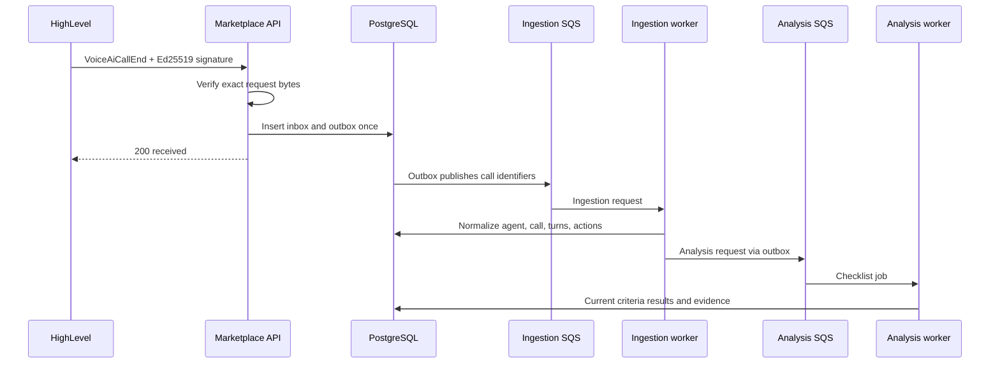

# HighLevel sandbox installation and verification

This is the operator runbook for installing the assignment as a private HighLevel
Marketplace app in a sandbox Location. It separates the settings configured in HighLevel
from the behavior owned by this repository.

## Integration choice

The app uses a **Marketplace Custom Page**, not Custom JS. HighLevel owns the Location
navigation entry and iframe; our infrastructure owns the Vue application, NestJS API,
workers, PostgreSQL, queues, and model requests.

The account hierarchy is:

```text
Developer Marketplace account
  private Marketplace app and test version

App Test Account (sandbox Agency)
  Sub-account / Location
    Voice AI agents and calls
    installed Marketplace app
    embedded Custom Page
```

The Marketplace app targets **Sub-account**. An Agency user may initiate installation, but
the resulting grant must authorize the selected Location. A Private Integration Token is
supported only as a local-development fallback and does not install the app, provide signed
iframe context, or subscribe the webhook.

## Deployed URLs

| Purpose          | URL                                                             |
| ---------------- | --------------------------------------------------------------- |
| Custom Page      | `https://dng3naypayh7.cloudfront.net/`                          |
| OAuth redirect   | `https://dng3naypayh7.cloudfront.net/api/leadconnector/oauth`   |
| Webhook receiver | `https://dng3naypayh7.cloudfront.net/api/leadconnector/webhook` |
| Readiness        | `https://dng3naypayh7.cloudfront.net/api/health/ready`          |

For another environment, replace the origin consistently. The redirect must exactly match
the saved Marketplace value, including path and trailing slash behavior.

## Marketplace builder configuration

### 1. App identity and distribution

- Create a **Private** app.
- Name it **Voice AI Observability Copilot**.
- Set **Target User** to **Sub-account**. HighLevel does not allow this choice to be changed
  after creation.
- Allow the sandbox Agency or Sub-account user who will perform the test installation.
- Add the 400 x 400 app icon and assignment screenshots to the test listing.

### 2. Custom Page module

Under **Build > Modules**, add one Custom Page:

- navigation label: **Voice AI Observability Copilot**;
- Live URL and Testing URL: the Custom Page URL above;
- placement: the Location left navigation;
- Custom JS: disabled.

The frontend requests HighLevel user data from the parent window, sends the opaque encrypted
payload to the API, and receives a short-lived Location-bound application session. A plain
`locationId` query parameter is never the production authorization boundary.

### 3. OAuth scopes

Grant only the read scopes used by the app:

| Scope                           | Use                                                       |
| ------------------------------- | --------------------------------------------------------- |
| `voice-ai-dashboard.readonly`   | Read call logs and receive `VoiceAiCallEnd`               |
| `voice-ai-agents.readonly`      | Read Voice AI agents and the current prompt/configuration |
| `voice-ai-agent-goals.readonly` | Read configured goals/actions when returned by HighLevel  |

No agent, workflow, contact, or Voice AI write scope is needed. The app recommends prompt
text but never applies a change. A direct Sub-account installation needs only the three scopes
above. If the app is configured for **Agency bulk installation**, also grant `oauth.readonly`
and `oauth.write`: the Company-token flow must list installed Locations and exchange the Company
token for each Location token. Those OAuth scopes authorize token routing, not Voice Agent edits.

Save scopes before making a version live. A scope change to a live app requires a new draft
version and reinstall/update grant.

### 4. OAuth and shared secrets

Under the app's Auth/Secrets settings:

- register the exact OAuth redirect URL above;
- copy the Client ID and one Client Secret;
- generate the Shared Secret used for encrypted Custom Page user context;
- generate the token encryption key locally with `openssl rand -base64 32`;
- store all four values in backend secrets only.

Multiple Client Keys allow independent credential rotation or environments. The assignment
uses one current key. Never place any secret in a `VITE_*` variable, browser bundle,
screenshot, or demo recording.

### 5. Webhook

In **Advanced Settings > Webhooks**:

- set the webhook URL shown above;
- enable `VoiceAiCallEnd`;
- save the version.

Install/update/uninstall lifecycle messages are platform lifecycle events and may not appear
as separate selectable checkboxes. The same receiver accepts supported lifecycle events.
Every incoming event is verified with HighLevel's Ed25519 signature over the exact raw bytes,
then stored idempotently before background processing.

### 6. Create and install a test version

1. Save a Marketplace version containing the final module, scopes, redirect, and webhook.
2. Generate the standard **Test Link** for the sandbox Location ID.
3. Open it while signed into the App Test Account.
4. Select/confirm the intended Sub-account and authorize the app.
5. Confirm the callback lands on `/?oauth=connected&locationId=...`.
6. Open the Location and confirm **Voice AI Observability Copilot** appears in navigation.
7. Open the page and confirm it renders inside HighLevel without an iframe/CSP error.

Use the standard link for the normal HighLevel-branded sandbox. A white-label link is only
for an Agency's custom branded domain; it does not change OAuth behavior or application data.

## Runtime behavior after installation

### OAuth and tenant storage

The callback exchanges the one-time code at LeadConnector, encrypts access and refresh tokens,
and persists the installation hierarchy. A Location token is stored directly. If an Agency
installer receives a Company token, the backend exchanges it for the approved Location token.
Refresh-token rotation updates the encrypted pair atomically.

### Existing-call sync

Build the workspace and run the sync command with backend environment variables loaded:

```bash
pnpm build
pnpm --filter @copilot/api sync:location -- <highlevel-location-id>
```

The sync reads Voice AI agents and call logs, stores the current agent prompt/configuration,
and writes one synthetic webhook inbox/outbox record per new call. It is convergent: running
it again does not create duplicate calls. Current assignment scope processes the page returned
by HighLevel; scheduled pagination and watermark reconciliation are explicit production
increments rather than hidden claims.

### Future-call ingestion



The webhook request never waits for a model. SQS retries transient failures and sends exhausted
messages to the matching DLQ. Queue payloads contain internal identifiers rather than transcript
content.

### Call Analysis

The analysis worker loads only:

- transcript turns;
- executed Call Action events supplied by HighLevel;
- the Voice Agent's current Success Criterion descriptions.

One structured model request independently returns `pass`, `fail`, `not_applicable`, or
`unknown` for every criterion. A failure is downgraded to `unknown` unless it cites a real
stored transcript turn or action event. The agent prompt is deliberately excluded because
the system cannot prove which current prompt handled a historical call.

Every new agent receives a small universal checklist on first analysis. In the agent page,
the user can add criteria derived from that agent's goal or script, edit a criterion's full
description, or delete criteria. A criterion name is its stable per-agent aggregation key;
the description is the complete evaluator instruction.

### Agent recommendation

Recommendations are agent-level and user-requested. For one failed criterion, the worker:

1. samples at most the 20 most recent current failed calls;
2. loads their failure reasons and validated evidence;
3. compares the concern with the **current** agent prompt;
4. returns no recommendation when the prompt already covers it or evidence is uncertain;
5. otherwise stores one concise instruction that can be pasted into the prompt.

There is at most one replaceable recommendation per agent and criterion. It is never applied
through the HighLevel API. A synced prompt change invalidates stored recommendations, and a
late response for an older prompt/request cannot replace current guidance.

## UI verification

### Fleet dashboard

- Voice Agents from the active Location are listed.
- Calls analyzed, average duration, and total failed criterion results are visible.
- Search filters by agent name.

### Agent page

- Call log and Success Criteria are visible together.
- Selecting a criterion filters the call log to calls that failed it.
- Criteria can be created, edited, and deleted.
- A call or the last 24 hours/7 days can be reanalyzed.
- Recommendation generation is available only for a failed criterion.
- Generated guidance states the criterion, supporting-call count, reason, and copy-paste text.

### Call page

- The transcript is the primary content.
- Only failed criteria appear as flagged issues.
- **View evidence** scrolls to and highlights the exact cited transcript line.
- The right-side context stays available in a collapsible strip on smaller widths.
- There is no call-level recommendation panel.

The brief's example of highlighting segments that need human review or script training is
implemented through failed criteria plus validated evidence navigation, not a separate queue of
ambiguous "actions."

## End-to-end acceptance checklist

### Installation and access

- [ ] OAuth callback stores the intended Location installation without exposing tokens.
- [ ] Custom Page appears inside the sandbox Location.
- [ ] Signed user context resolves the same Location as the grant.
- [ ] Changing a query-string Location ID does not cross the session boundary.

### Existing calls

- [ ] Historical sync imports all calls needed for the demo.
- [ ] A second sync creates no duplicate agent or call rows.
- [ ] Calls progress from ingestion to current checklist results.

### New call

- [ ] Complete a Voice AI Web Call.
- [ ] Confirm `VoiceAiCallEnd` appears in Marketplace webhook logs.
- [ ] Confirm the endpoint returns `2xx` promptly.
- [ ] Confirm inbox/outbox, ingestion queue, normalized call, analysis queue, and results.
- [ ] Redeliver/requeue and confirm one call remains.

### Analysis and recommendation

- [ ] Every call shows all applicable Success Criteria results.
- [ ] Every failure links to exact stored evidence.
- [ ] A custom criterion is evaluated after automatic reanalysis.
- [ ] Failed criteria roll up to the correct agent and dashboard counts.
- [ ] Requested guidance is either suppressed as covered/uncertain or is directly pasteable.
- [ ] Deleting guidance removes it; regenerating replaces it.

### Operations and security

- [ ] Invalid webhook signatures are rejected.
- [ ] Browser assets contain no PIT, OAuth, shared, model, or database secret.
- [ ] API readiness checks PostgreSQL.
- [ ] SQS/DLQ and API-health CloudWatch alarms exist.
- [ ] Containers run as non-root with read-only filesystems.

## Configuration ownership

| Configuration                                      | Owner                                   | Status                  |
| -------------------------------------------------- | --------------------------------------- | ----------------------- |
| Marketplace app/version, Custom Page, scopes, URLs | Manual in HighLevel                     | Required external setup |
| Client and shared secrets                          | Manual creation, backend secret storage | Implemented             |
| OAuth tokens and Location grants                   | Application                             | Implemented             |
| Historical sync trigger                            | Operator                                | Implemented, manual     |
| Real-time webhook pipeline                         | Application                             | Implemented             |
| Universal and user-defined criteria                | Application user                        | Implemented             |
| Checklist evaluation and evidence validation       | Analysis worker                         | Implemented             |
| Prompt recommendation generation                   | Application user + analysis worker      | Implemented, on demand  |
| Applying a recommended change                      | HighLevel user                          | Intentionally manual    |

## Relevant HighLevel documentation

- [Create a Marketplace App](https://marketplace.gohighlevel.com/docs/oauth/CreateMarketplaceApp/)
- [App distribution](https://marketplace.gohighlevel.com/docs/oauth/AppDistribution/)
- [Install and test an app](https://marketplace.gohighlevel.com/docs/2023-02-21/oauth/TestingApp/)
- [Custom Pages](https://marketplace.gohighlevel.com/docs/2023-02-21/marketplace-modules/CustomPages/)
- [Marketplace user context](https://marketplace.gohighlevel.com/docs/2021-07-28/other/user-context-marketplace-apps/)
- [Sub-account target authorization](https://marketplace.gohighlevel.com/docs/Authorization/TargetUserSubAccount/)
- [OAuth scopes](https://marketplace.gohighlevel.com/docs/Authorization/Scopes/)
- [Voice AI call logs](https://marketplace.gohighlevel.com/docs/ghl/voice-ai/dashboard/)
- [VoiceAiCallEnd](https://marketplace.gohighlevel.com/docs/2021-04-15/webhook/VoiceAiCallEnd/)
- [Webhook integration guide](https://marketplace.gohighlevel.com/docs/webhook/WebhookIntegrationGuide/)
