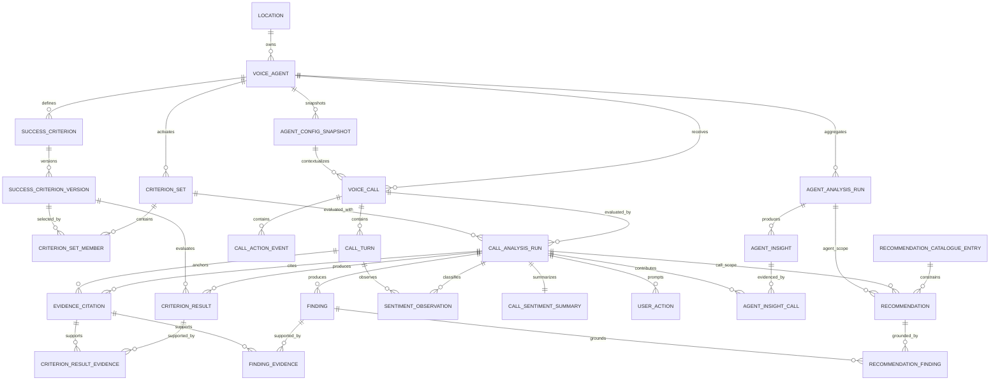
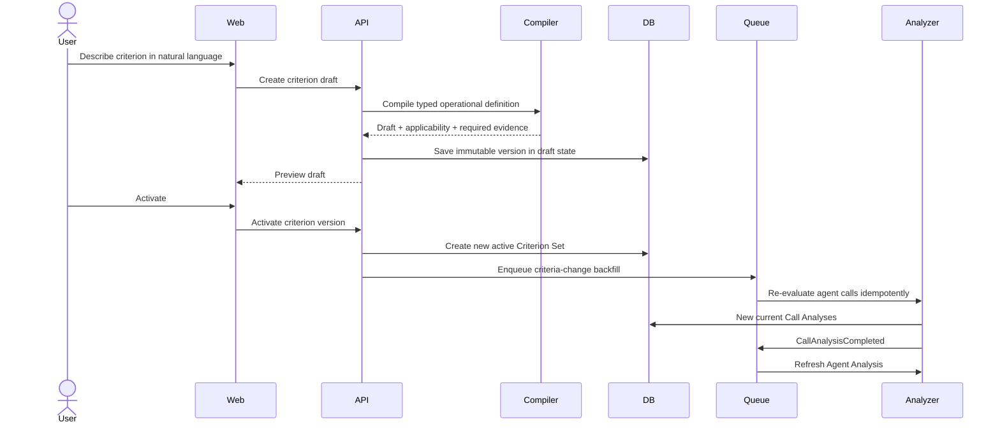
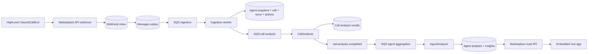

# Breaking observability refactor plan

Status: superseded by ADR 0007
Date: 2026-07-17

> Historical refactor plan. The implemented design deliberately removed configuration snapshots,
> criterion versions and sets, analysis releases, call recommendations, and automatic guidance.

## Objective

Replace the current observability implementation with a product-shaped model derived from
the supplied Stitch dashboard and call-analysis references. The references define the
visual language and major information regions; they are not pixel-perfect specifications.
The new agent page completes the flow by aggregating call analyses under one Voice Agent
and allowing users to define Success Criteria for that agent.

This is a breaking change. The old observability tables, evaluator output, contracts,
queries, and Vue workspace will be removed rather than adapted. OAuth, tenant hierarchy,
webhook inbox/outbox, and SQS delivery infrastructure remain.

## Product contract

### Visual and layout contract

Reference screens:

- `stitch/projects/5390106103004145139/screens/8df461e7ce9947ce85e9b20fd60b9d04`
- `stitch/projects/5390106103004145139/screens/41f4fce343c147fdb09367bfb8896fbe`

Use their look, density, and large-scale composition without reproducing incidental layout
mistakes:

- cool off-white canvas, white data surfaces, indigo primary accents, restrained red/green
  evidence states, Inter headings, and Geist labels/data;
- 12-column desktop grid with a maximum content width around 1,440 px;
- compact list/table hierarchy on the fleet dashboard;
- transcript-led call analysis using approximately eight columns for evidence and four for
  the intelligence panel, collapsing to one column at embedded/mobile widths;
- thin borders and restrained shadows rather than oversized cards or metric tiles;
- evidence highlights inline with the transcript, with View Evidence navigation from the
  checklist;
- the new Agent page uses the same header, surface, spacing, and intelligence-panel grammar
  so it feels like the missing middle screen rather than a separate application.

Reference copy, sample percentages, timestamps, and example data are not authoritative.
Every rendered value must map to the contracts below.

### Fleet dashboard

The dashboard remains a compact, searchable agent list in the reference's visual system.
Each row is backed by a current Agent Analysis, not ad hoc client calculations.

| UI field         | Definition                                                                                                                                                                                                                                         |
| ---------------- | -------------------------------------------------------------------------------------------------------------------------------------------------------------------------------------------------------------------------------------------------- |
| Agent name       | Current HighLevel Voice Agent name.                                                                                                                                                                                                                |
| Calls analyzed   | Calls with a current completed Call Analysis in the selected cohort.                                                                                                                                                                               |
| Average duration | Arithmetic mean of source call durations; not a quality signal.                                                                                                                                                                                    |
| Script adherence | Unweighted clear results divided by observable, applicable results for prompt-derived and user-defined Success Criteria only. Universal safety and diagnostic checks are excluded. The UI must expose the numerator and denominator on inspection. |
| Flagged issues   | Calls with at least one `review` or `critical` Criterion Result, or an open Recommendation. This opens the evidence list; it is not a score.                                                                                                       |

No weighted score or overall agent grade is introduced. A critical safety result remains
prominent even when adherence is high.

### Agent page

The missing Agent page is the aggregation and configuration surface.

1. **Header summary** — calls analyzed, average duration, success-criterion adherence,
   calls requiring review, and the active Agent Configuration Snapshot.
2. **Agent Insights** — evidence-backed recurring patterns and conclusive single-call
   observations, with affected calls and exact Criterion Results.
3. **Success Criteria** — active criteria with applicability, result distribution, source,
   version, and lifecycle controls. A user can add a criterion in natural language,
   inspect the compiled draft, and explicitly activate it.
4. **AI Recommendations** — advisory changes grounded in Agent Insights and restricted to
   the versioned HighLevel recommendation catalogue.
5. **Calls** — the reference-style list of calls under this agent, filterable by criterion,
   outcome, sentiment, and review state.

There is no minimum-call gate. One conclusive call may appear as a **single observation**;
multiple comparable calls may be labelled a **repeated pattern**.

### Call-analysis page

The call page follows the reference's transcript-plus-intelligence layout.

1. **Transcript Forensic View** — normalized turns with evidence highlights. The UI uses
   turn numbers. It must not fabricate timestamps; source timestamps may be stored when
   genuinely available but are optional and not required by the product.
2. **AI Recommendations** — manual HighLevel changes showing target tier, UI path,
   rationale, proposed change, evidence, validation steps, and missing data.
3. **Call Summary** — concise factual summary and outcome.
4. **Call Sentiment** — a customer-turn distribution with a dominant categorical label and
   observable-turn denominator. It is not an opaque model confidence percentage.
5. **Success Criteria Checklist** — one row per active criterion with `clear`, `review`,
   `critical`, `not_applicable`, or `not_observable`, plus direct evidence navigation.
6. **Recommendations** — consolidated concrete interventions such as caller follow-up, human
   review, or script training. A failed criterion does not automatically create a separate
   Recommendation.

### Recommendation interaction policy

Recommendations never mutate HighLevel. The application will not expose an apply endpoint
or an Apply button. Allowed interactions are:

- view supporting evidence;
- copy the proposed text or checklist;
- navigate to documented HighLevel settings when a stable manual path exists;
- dismiss or archive the recommendation inside this application.

Success-Criterion controls modify this application's evaluation configuration and may
trigger reanalysis. They do not modify the HighLevel Voice Agent.

## Canonical domain model



## PostgreSQL replacement schema

The integration tables remain unchanged: companies, locations, installations, grants,
sessions, webhook inbox, message outbox, processed messages, and ingestion jobs.

The following observability tables replace `agents`, `calls`, `analyses`, `metric_results`,
`sentiment_assessments`, `rubrics`, and the current recommendation/action persistence.

### Agent and configuration

#### `voice_agents`

- `id uuid primary key`
- `location_id uuid not null references locations(id)`
- `highlevel_agent_id varchar(64) not null`
- `name text not null`
- `lifecycle_state varchar(24) not null`
- `created_at`, `updated_at`
- unique `(location_id, highlevel_agent_id)`

This fixes the current split in which `agents.location_id` is an external string while
calls also carry an internal tenant location.

#### `agent_config_snapshots`

- `id uuid primary key`
- `agent_id uuid not null references voice_agents(id)`
- `source_hash varchar(64) not null`
- `source varchar(24) not null` — `highlevel_api | user_supplemented | fixture`
- `configuration jsonb not null` — validated typed configuration with explicit
  `known | unknown | known_empty` states
- `evidence_capabilities jsonb not null` — transcript, action config, audio, timestamps,
  attached KB, speech settings, and granted-scope availability
- `captured_at`, `valid_from`, `valid_to`
- unique `(agent_id, source_hash)`

HighLevel's evolving external configuration stays in an immutable JSON snapshot behind a
strict Zod schema. Core relationships and result data remain normalized.

### Success Criteria

#### `success_criteria`

- `id uuid primary key`
- `agent_id uuid not null references voice_agents(id)`
- `stable_key varchar(96) not null`
- `origin varchar(32) not null` — `universal | prompt_generated | user_defined |
configuration`
- `criterion_class varchar(24) not null` — `adherence | safety | outcome | diagnostic`
- `lifecycle_state varchar(24) not null` — `draft | active | retired`
- `created_by_user_id uuid null references marketplace_users(id)`
- `created_at`, `updated_at`
- unique `(agent_id, stable_key)`

#### `success_criterion_versions`

- `id uuid primary key`
- `criterion_id uuid not null references success_criteria(id)`
- `version integer not null`
- `title text not null`
- `natural_language_rule text not null`
- `applicability_definition jsonb not null`
- `evaluation_instructions text not null`
- `required_evidence jsonb not null`
- `severity_policy jsonb not null`
- `source_references jsonb not null`
- `allowed_recommendation_target_ids text[] not null`
- `compiler_version varchar(48) not null`
- `created_at`
- unique `(criterion_id, version)`

Versions are immutable. Editing a criterion creates a new version.

#### `criterion_sets` and `criterion_set_members`

An immutable set gives every Call Analysis an exact criterion fingerprint.

`criterion_sets`: `id`, `agent_id`, `version`, `fingerprint`, `active`, `created_at`; unique
`(agent_id, version)` and `(agent_id, fingerprint)`.

`criterion_set_members`: `criterion_set_id`, `criterion_version_id`, `display_order`;
primary key `(criterion_set_id, criterion_version_id)`.

### Source calls

#### `voice_calls`

- `id uuid primary key`
- `agent_id uuid not null references voice_agents(id)`
- `location_id uuid not null references locations(id)`
- `agent_config_snapshot_id uuid not null references agent_config_snapshots(id)`
- `source_webhook_inbox_id uuid null references webhook_inbox(id)`
- `highlevel_call_id varchar(64) not null`
- `contact_id varchar(64) null`
- `direction varchar(16) null`
- `source_transcript text not null`
- `source_summary text null`
- `duration_seconds integer not null`
- `extracted_data jsonb not null`
- `call_created_at`, `ingested_at`
- unique `(location_id, highlevel_call_id)`

#### `call_turns`

- `id uuid primary key`
- `call_id uuid not null references voice_calls(id)`
- `ordinal integer not null`
- `speaker varchar(16) not null` — `agent | customer | unknown`
- `text text not null`
- `source_start_ms integer null`, `source_end_ms integer null`
- unique `(call_id, ordinal)`

The nullable source timing fields are future evidence only. They are not inferred and the
current UI does not display them.

#### `call_action_events`

- `id`, `call_id`, `ordinal`
- `highlevel_action_id`, `action_type`, `action_name`
- `outcome varchar(24)`, `result_summary jsonb`
- `source_occurred_at timestamptz null`
- unique `(call_id, ordinal)`

### Call evaluation

#### `call_analysis_runs`

- `id uuid primary key`
- `call_id uuid not null references voice_calls(id)`
- `config_snapshot_id uuid not null references agent_config_snapshots(id)`
- `criterion_set_id uuid not null references criterion_sets(id)`
- `run_sequence integer not null`
- `run_reason varchar(24) not null` — `initial | retry | manual | criteria_change |
backtest`
- `input_fingerprint varchar(64) not null`
- `status varchar(24) not null`
- `outcome varchar(24) null`
- `intent_key varchar(96) null`
- `summary text null`
- `evidence_coverage jsonb not null`
- `provider`, `model`, `model_parameters jsonb`
- `evaluator_version`, `output_schema_version`, `code_version`
- lease, attempt, error, start, and completion fields
- `is_current boolean not null`
- unique `(call_id, run_sequence)` and `(call_id, input_fingerprint)`
- partial unique index for one current run per call

#### `criterion_results`

- `id uuid primary key`
- `analysis_run_id uuid not null references call_analysis_runs(id)`
- `criterion_version_id uuid not null references success_criterion_versions(id)`
- `status varchar(24) not null` — categorical states only
- `assessor varchar(24) not null` — `semantic | deterministic | hybrid`
- `rationale text not null`
- `created_at`
- unique `(analysis_run_id, criterion_version_id)`

No score, normalized score, weight, or pass boolean is stored.

#### `findings`

- `id`, `analysis_run_id`, optional `criterion_result_id`
- `kind`, `severity`, `title`, `explanation`, `root_cause_category`
- `created_at`

Findings describe what happened. Recommendations describe a supported manual HighLevel
configuration change.

#### Evidence tables

`evidence_citations`: `id`, `analysis_run_id`, `call_turn_id`, `quote`, nullable character
offsets, `evidence_type`; citations are validated against the immutable turn text.

`criterion_result_evidence`: primary key `(criterion_result_id, evidence_citation_id)`.

`finding_evidence`: primary key `(finding_id, evidence_citation_id)`.

This removes transcript references from opaque JSON and makes every View Evidence action
a stable relational lookup.

#### Sentiment tables

`sentiment_observations`: one row per observable customer turn with `analysis_run_id`,
`call_turn_id`, ordinal `valence` from -2 to +2, categorical label, rationale, and unique
`(analysis_run_id, call_turn_id)`.

`call_sentiment_summaries`: one row per run with dominant label, positive/neutral/negative
turn counts, observable customer-turn count, ending label, and rationale. UI percentages
are deterministically derived from these counts and always retain the denominator.

### Recommendation catalogue and instances

#### `recommendation_catalogue_entries`

Seed all 36 researched targets from
`highlevel-voice-ai-suggestion-catalogue.v1.json`:

- `catalogue_version`, `target_id` composite primary key
- `tier` — `primary | feature | advanced`
- `category`, `title`, `ui_path`
- original API documentation status retained for provenance
- `evidence_policy`, `required_evidence`, `signals`, `guardrails`, `validation_steps`
- `source_references`
- `enabled`

Product execution policy overrides the research's API capability: every emitted
Recommendation is persisted as `manual_highlevel_ui`.

#### `recommendations`

- `id uuid primary key`
- `agent_id uuid not null`
- exactly one of `call_analysis_run_id` or `agent_analysis_run_id`
- `catalogue_version`, `target_id`
- `tier`, `title`, `rationale`, `proposed_change`
- `ui_path`, `verification_plan`, `missing_evidence jsonb`
- `evidence_policy`, `execution_mode = manual_highlevel_ui`
- `status` — `suggested | dismissed | archived`
- `deduplication_key varchar(64)`
- timestamps
- unique `(agent_id, deduplication_key)` for active suggestions
- check constraint enforcing exactly one source scope

`recommendation_findings` links recommendations to one or more Findings. No recommendation
may exist without a supported catalogue entry and at least one Finding.

### Agent aggregation

#### `agent_analysis_runs`

- `id`, `agent_id`, `criterion_set_id`
- `cohort_definition jsonb` and `call_analysis_cutoff_at`
- `input_fingerprint`, `status`, `is_current`
- `summary jsonb` with typed counts used by the dashboard
- model/evaluator provenance when narrative synthesis is used
- timestamps and error fields
- unique `(agent_id, input_fingerprint)` and partial unique current-run index

The default cohort contains all current Call Analyses for the agent. When multiple Agent
Configuration Snapshots occur in the cohort, the aggregation preserves snapshot breakdowns
and does not present before/after differences as one homogeneous trend.

The validated `summary` shape is:

```ts
interface AgentAnalysisSummary {
  callsAnalyzed: number;
  averageDurationSeconds: number | null;
  adherence: { clear: number; observable: number; percent: number | null };
  flaggedCallCount: number;
  customerSentiment: {
    positiveTurns: number;
    neutralTurns: number;
    negativeTurns: number;
    observableTurns: number;
  };
}
```

#### `agent_insights`

- `id`, `agent_analysis_run_id`, optional `criterion_version_id`
- `kind`, `severity`, `title`, `narrative`
- `evidence_strength` — `single_observation | repeated_pattern`
- `assessed_call_count`, `clear_count`, `review_count`, `critical_count`
- `intent_breakdown jsonb`, `config_snapshot_breakdown jsonb`

`agent_insight_calls` links each insight to contributing `call_id`, `call_analysis_run_id`,
and optional `criterion_result_id`. This is how the Agent page filters to the exact calls
behind one insight.

## Analyzer redesign

### Deep modules and interfaces

The external analysis seam exposes two deep modules:

```ts
interface CallAnalyzer {
  analyze(request: AnalyzeCallRequest): Promise<CallAnalysisOutput>;
}

interface AgentAnalyzer {
  aggregate(request: AggregateAgentRequest): Promise<AgentAnalysisOutput>;
}
```

Callers do not orchestrate prompt compilation, evidence validation, recommendation
eligibility, or persistence details. Internally:

1. **EvaluationPlanResolver** loads the immutable Agent Configuration Snapshot,
   Criterion Set, and recommendation catalogue version.
2. **EvidenceAssembler** normalizes/redacts turns, action events, and coverage facts.
3. **SemanticJudge** evaluates only the supplied Criterion Versions and returns structured
   results, Findings, customer-turn sentiment observations, and intervention candidates.
4. **FactVerifier** performs deterministic predicates, checks configured/executed action
   IDs, and validates every quote against Call Turns.
5. **RecommendationPlanner** receives validated Findings plus an allow-list of eligible
   catalogue entries. It selects target IDs and writes guidance, then a deterministic
   policy gate rechecks tier, evidence requirements, known configuration, and manual-only
   execution.
6. **AgentAggregator** computes exact SQL aggregates and optionally asks a model to write
   a narrative that may reference only supplied criterion IDs, counts, and call IDs.

The structured-language-model interface remains the provider-neutral seam. Production
and test adapters justify it; Postgres repositories remain internal adapters rather than
being leaked through analyzer interfaces.

### Intended code layout

```text
packages/contracts/src/observability/
  dashboard.contract.ts
  agent-analysis.contract.ts
  call-analysis.contract.ts
  success-criteria.contract.ts

packages/database/src/schema/
  tenant.ts
  integration.ts
  observability.ts

apps/analysis-worker/src/
  call-analysis/          # CallAnalyzer and internal evidence/evaluation modules
  agent-analysis/         # AgentAnalyzer and cohort aggregation
  criteria/               # compiler, version/set resolver, universal templates
  recommendations/        # catalogue loader and manual-only policy
  language-model/         # existing provider-neutral seam and adapters

apps/api/src/observability/
  dashboard-query.module.ts
  agent-query.module.ts
  call-query.module.ts
  success-criteria-command.module.ts

apps/web/src/features/
  dashboard/
  agent-analysis/
  call-analysis/
  success-criteria/
```

Each module presents one product-shaped interface. Query modules return complete screen
contracts rather than exposing repositories or requiring Vue to join domain fragments.

### New call-evaluation output

```ts
interface CallAnalysisOutput {
  summary: string;
  intent: { key: string; description: string };
  outcome: 'success' | 'partial' | 'failure' | 'not_observable';
  criterionResults: Array<{
    criterionVersionId: string;
    status: 'clear' | 'review' | 'critical' | 'not_applicable' | 'not_observable';
    rationale: string;
    evidence: TurnCitation[];
  }>;
  findings: FindingOutput[];
  sentimentObservations: CustomerTurnSentiment[];
  recommendations: RecommendationOutput[];
  recommendationCandidates: RecommendationCandidate[];
}
```

The model never returns weights, an overall score, arbitrary target names, or fabricated
timestamps.

### Recommendation tier policy

The existing researched catalogue remains authoritative:

- **Primary (6)** — prompt, action-trigger instructions, fallbacks, greeting, greeting
  pause, and custom values. Prefer first when they directly address the cause.
- **Feature (18)** — Knowledge Base, documented actions, call settings, language,
  translation, post-call workflows, routing, and reporting. Use when wording alone cannot
  supply data or perform the operational capability.
- **Advanced (12)** — transcription, pronunciation, speech/audio, behavior, temperature,
  voice/model, system prompts, and outbound configuration. Require the catalogue's stronger
  evidence policy and explicit validation plan.

Selection rules:

1. Determine root cause before target selection.
2. Offer the lowest tier that directly resolves that root cause; do not mechanically emit
   one recommendation per tier.
3. A target must be in the active catalogue version and allowed by the relevant Criterion
   Version or Finding category.
4. Satisfy `requiredEvidence`; otherwise persist the missing evidence and suppress or phrase
   the item as an inspection proposal according to the catalogue guardrail.
5. Advanced acoustic/transcription recommendations require audio or trusted ground truth.
6. Unknown current settings are not treated as disabled or incorrect.
7. Persist the exact catalogue version and validation steps.
8. Always emit `manual_highlevel_ui`; never call HighLevel mutation endpoints.

### Success-Criterion creation flow



The compiler leaves impossible criteria as drafts with a clear data requirement. For
example, “sound warm” is not observable without audio. Activation never silently changes
the meaning of existing historical results; new analyses reference the new Criterion Set.

## Event flow



Queue payloads contain identifiers, fingerprints, and tenant context only—never transcript
text or OAuth credentials.

### Idempotency

- Call-analysis uniqueness: `(call_id, input_fingerprint)` where the fingerprint covers
  call source hash, config snapshot, criterion set, evaluator schema, and catalogue version.
- Agent-analysis uniqueness: `(agent_id, input_fingerprint)` where the fingerprint covers
  ordered current call-analysis IDs and cohort definition.
- Criteria-change backfills page through call IDs and safely enqueue duplicates.
- Recommendation deduplication uses agent, target ID, config snapshot/cohort, and sorted
  Finding fingerprints.
- Current-run switches and all child inserts occur in one Postgres transaction.

## Read contracts

### `GET /observability/agents`

Returns dashboard rows only: agent identity, current Agent Analysis summary, calls analyzed,
average duration, adherence numerator/denominator/percentage, flagged-call count, and
analysis freshness.

### `GET /observability/agents/:agentId`

Returns:

- current aggregate summary and active configuration snapshot metadata;
- Agent Insights with exact contributing call IDs;
- active/draft/retired Success Criteria and result distributions;
- advisory agent Recommendations;
- paginated/filterable calls.

### Success-Criterion commands

- `POST /observability/agents/:agentId/success-criteria/drafts`
- `POST /observability/agents/:agentId/success-criteria/:criterionId/activate`
- `PUT /observability/agents/:agentId/success-criteria/:criterionId` — creates a version
- `POST /observability/agents/:agentId/success-criteria/:criterionId/retire`

Every command checks location ownership. Activation returns an asynchronous backfill job.

### `GET /observability/calls/:callId`

Returns normalized turns, current Call Analysis, Criterion Results, Findings and citations,
sentiment counts, manual Recommendations, and run provenance.

### Deliberately absent

- no recommendation-apply endpoint;
- no HighLevel-agent PATCH from the observability module;
- no generic metric/score endpoint;
- no compatibility route for the old dashboard payload.

## Breaking migration

1. Stop analysis consumers and record an optional fixture/export for comparison only.
2. Keep installation, OAuth, tenant, inbox/outbox, and processed-message tables.
3. Drop the existing observability tables in dependency order. Do not transform old generic
   metric rows into Success-Criterion Results because their meaning is not equivalent.
4. Create the replacement schema and constraints.
5. Seed the 36-entry recommendation catalogue and universal criterion templates.
6. Re-ingest the HighLevel test location and the evaluation agents/calls.
7. Capture an Agent Configuration Snapshot for every Voice Agent.
8. Create the initial active Criterion Set from universal criteria plus approved
   prompt-derived criteria.
9. Enqueue all calls for analysis, then aggregate each agent after current call runs finish.
10. Deploy the new read contracts and Vue app atomically. Delete old contracts, queries,
    evaluator schemas, and tests in the same change.

For the local assignment environment, reset the Postgres volume after the breaking Drizzle
migration. Do not rewrite already-applied integration migrations; a production-like reset
uses an explicit destructive observability migration.

## Implementation slices

### Slice 1 — Schema and seed data

- replacement Drizzle schema and destructive migration;
- recommendation catalogue importer with schema validation;
- universal criterion templates;
- relational fixtures for Theobroma and Harper Valley.

Exit: migration from the current local database succeeds, constraints hold, and a clean
database can be seeded deterministically.

### Slice 2 — Ingestion and immutable context

- `voice_agents`, Agent Configuration Snapshots, calls, normalized turns, and action events;
- call-to-snapshot linkage;
- explicit evidence-capability states.

Exit: the real HighLevel call and fixture calls can be ingested without analysis.

### Slice 3 — Success Criteria

- universal bootstrap, prompt compiler, natural-language draft compiler, versioning,
  activation, retirement, Criterion Sets, and backfill events;
- agent-page CRUD contracts.

Exit: a manual criterion can be drafted, reviewed, activated, and associated with an exact
Criterion Set.

### Slice 4 — CallAnalyzer

- new structured output; evidence assembler/validator; semantic and deterministic paths;
- Findings, sentiment observations, and catalogue-constrained Recommendations;
- transactional current-run persistence.

Exit: all evaluation-corpus calls produce schema-valid, evidence-valid call pages.

### Slice 5 — RecommendationPlanner

- import and gate all 36 catalogue entries;
- tier selection, knownness checks, missing-evidence handling, deduplication;
- manual-only recommendation contracts.

Exit: every recommendation points to an actual catalogue target and no mutation path exists.

### Slice 6 — AgentAnalyzer

- deterministic aggregates, criterion distributions, adherence numerator/denominator,
  insight-to-call links, optional constrained narrative synthesis;
- asynchronous refresh after call completion and criterion changes.

Exit: the Agent page is entirely backed by one auditable current Agent Analysis.

### Slice 7 — API and reference-led UI

- replace contracts and observability queries;
- implement dashboard, Agent page, and call forensic view in the reference visual system;
- success-criterion draft/activation flow and evidence navigation;
- no Apply controls for Recommendations.

Exit: all three screens work against the new contracts without client-side domain inference.

### Slice 8 — Delete the old system

- remove `metricResults`, `rubrics`, old semantic output, `ensureActionCoverage`, read-time
  agent aggregation, and old Vue state/types;
- remove superseded tests rather than layering compatibility tests.

Exit: searching for score, weight, generic metric, or old dashboard contracts finds no live
observability implementation.

## Verification strategy

### Database

- tenant and FK isolation tests;
- immutable-version and unique-current-run constraints;
- exactly-one recommendation scope check;
- evidence citation/turn ownership checks;
- migration and clean-seed tests.

### Analyzer

- schema-contract tests for every structured model response;
- citation validation rejects invented quotes and wrong turns;
- categorical status/applicability golden tests;
- no automatic Recommendation per failed criterion;
- sentiment shares equal deterministic turn counts;
- all recommendation target IDs exist in the chosen catalogue version;
- primary-before-feature-before-advanced policy cases;
- advanced recommendations suppressed without required evidence;
- provider-adapter contract tests and golden corpus regression tests.

### Agent aggregation

- exact criterion distributions and adherence denominator;
- single observation versus repeated pattern labelling;
- configuration-snapshot cohort separation;
- idempotent refresh and recommendation deduplication;
- insight links open only contributing calls.

### API and UI

- response-schema tests for the three read surfaces;
- authorization tests for every criterion command;
- no recommendation mutation endpoint or Apply control;
- dashboard, Agent, and call page browser tests using Theobroma scenarios;
- empty, one-call, mixed-status, unknown-configuration, and failed-analysis states;
- reference screenshots at desktop and embedded-width breakpoints.

## Decisions to hold during implementation

- The supplied visual references define look, density, and major layout regions; timestamps
  shown in them are not assumed to exist.
- Success Criteria are agent-owned, versioned, and explicitly activated.
- Criterion Results are immutable outputs of one version and one Call Analysis.
- Call-level analysis and Agent-level aggregation are different runs with different inputs.
- Recommendations are catalogue-constrained, evidence-backed, advisory, and manual-only.
- Recommendations are manual HighLevel configuration guidance, not aliases for failed checks.
- No compatibility layer, dual writes, or migration of semantically incompatible metrics.
